<h3 align="center">MCA Student | Java Backend Developer | Unity Game Developer | DSA Enthusiast</h3>

---

## 🚀 About Me

* 🎓 MCA student focused on **Backend Development**
* ☕ Learning **Java + Data Structures & Algorithms**
* 🎮 Building small games in **Unity**
* 💡 Interested in **software engineering & system design**
* 📫 Reach me: **[gamesorcerer48@gmail.com](mailto:gamesorcerer48@gmail.com)**

---

## 🛠️ Tech Stack

---

## ⭐ Featured Projects

### 🎮 Tilevania Adventure

Retro-inspired 2D platformer built using Unity with collectibles and platform mechanics.

### ☕ Quiz Platform Java

Java-based quiz platform with authentication, quiz creation and participation.

### 📋 Task Management System

Java console app for managing tasks with descriptions and due dates.

---

## 📊 GitHub Stats

      
  

     

---

## 📈 Contribution Graph

---

## 🐍 Contribution Snake

<picture>
<source media="(prefers-color-scheme: dark)" srcset="https://raw.githubusercontent.com/PrasoonGupta078/PrasoonGupta078/output/github-contribution-grid-snake-dark.svg">
<source media="(prefers-color-scheme: light)" srcset="https://raw.githubusercontent.com/PrasoonGupta078/PrasoonGupta078/output/github-contribution-grid-snake.svg">

</picture>

---

## 🌐 Connect With Me

Feel free to connect with me 👇

---

## ⚡ Fun Facts

- I enjoy building small indie games 🎮
- Interested in system design
- Coffee + coding = productivity ☕
